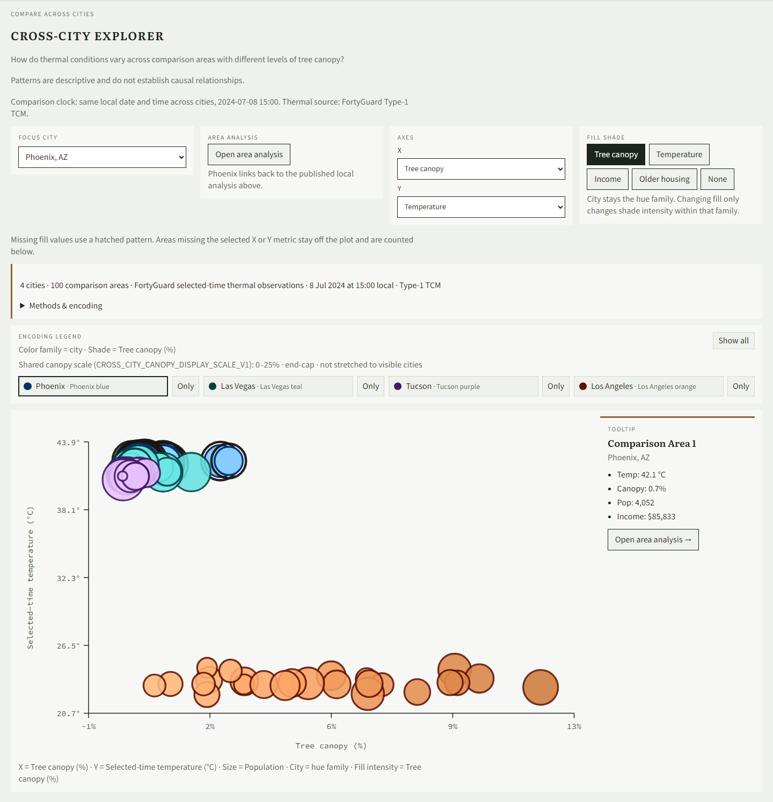
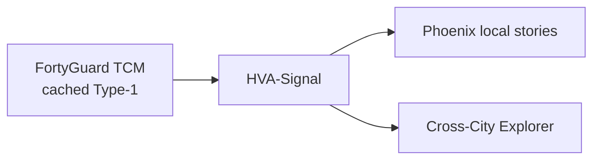
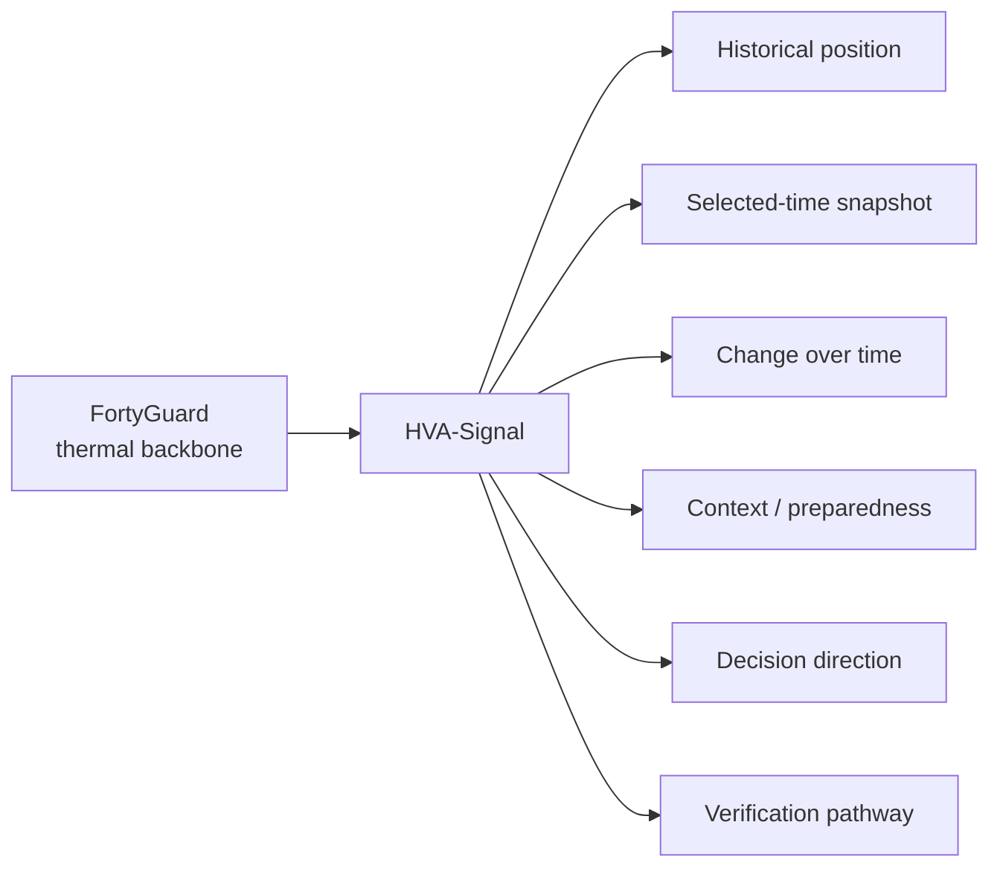
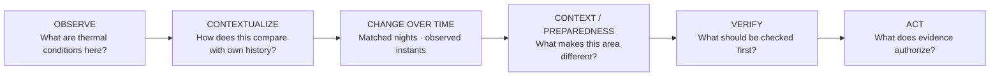
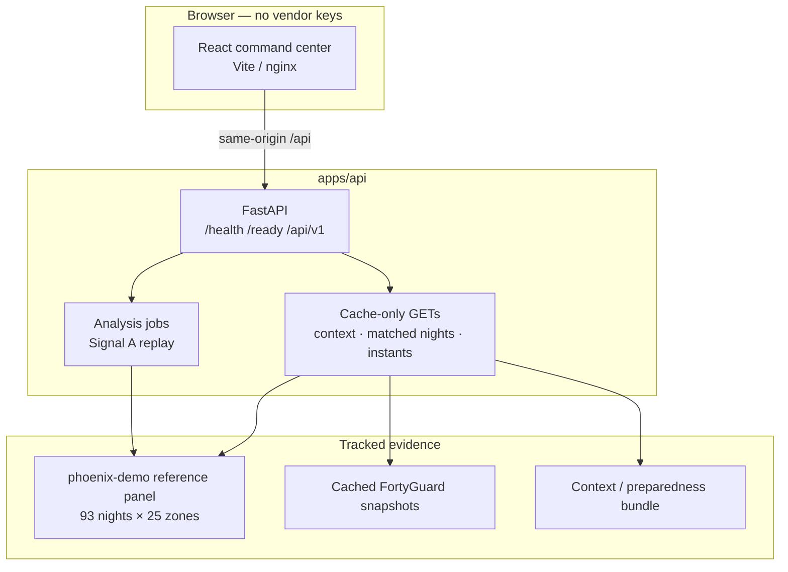
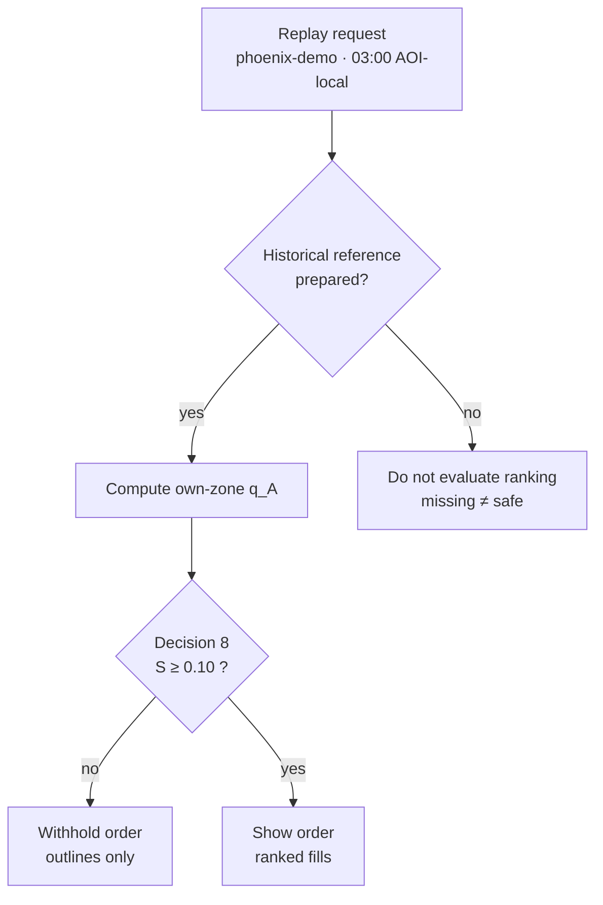

# HVA-Signal

**3K Labs** · Heat, Vulnerability & Action Signal

Comparable selected-time thermal observations, context, and decision framing — without inventing rankings the evidence cannot defend.

**FortyGuard** is the thermal intelligence backbone (Type-1 TCM). **HVA-Signal** adds historical reasoning, change-over-time interpretation, context (not scored), preparedness inventory status, decision direction, and an intervention-verification pathway.

The public path is accountless. Default data mode is `DATA_MODE=replay`. Hosted live acquisition is **disabled**. Runtime reads tracked product data only — it does not depend on `workforce/`.

---

## Live demo

Public Render validation (free tier; may sleep when idle):

- Web: see Deploy notes after blueprint sync — typically `urban-thermal-web.onrender.com`
- API health: paired `urban-thermal-api` service `/health`

No login. Leave **Data mode** on **Replay**. Scroll to **Cross-City Explorer** for the four-city comparison, or use the Phoenix local analysis above it.



---

## Why this exists

Municipal heat tools still collapse into **one map that ranks every night**. When the thermal field is flat, that ranking is a manufactured targeting list. HVA-Signal separates observe → contextualize → change → context → verify → act, and **withholds** order when spread cannot defend it.

---

## Experience (what judges see)

1. **Phoenix local command center** — Historical Thermal Position, selected-time snapshot, matched nights, observed instants, context/preparedness, Action framing (`phoenix-demo`, design contract frozen).
2. **Cross-City Explorer** — four curated cities · 100 comparison areas · FortyGuard selected-time TCM · **8 Jul 2024 at 15:00 local** civil clock.
   - Default: **X = tree canopy (%)**, **Y = selected-time temperature (°C)**, **size = population**, **city = hue family**, **fill shade = canopy** on `CROSS_CITY_CANOPY_DISPLAY_SCALE_V1` (0–25%, shared, end-capped).
   - Patterns are descriptive and do not establish causal relationships.
   - Yuma / Palm Springs heat-extreme candidates remain **blocked** on ALG1 geography (see `docs/multicity/HOT_CITY_EXPANSION_PREFLIGHT.md`). No hotter-than-Phoenix claims.

---

## Explorer encoding

| Channel | Meaning |
|---------|---------|
| Color family | City (OKLCH hue) |
| Shade | Selected fill metric intensity within that hue |
| Shared canopy scale | `CROSS_CITY_CANOPY_DISPLAY_SCALE_V1` — not stretched to visible cities |
| Outline | Darker shade of the city hue |
| Selection / hover | Neutral copper/black halo |

---

## Evidence & safeguards

- Real cached/replay FortyGuard Type-1 TCM for Phoenix, Las Vegas, Tucson, Los Angeles under `CROSS_CITY_OBSERVATION_V1`.
- ACS 2020–2024 context + NLCD TCC 2021 canopy under `CROSS_CITY_CANOPY_CONTRACT_V1`.
- Public live vendor **OFF**. Hosted end-user vendor triggering **OFF**. Allowance **0**.
- No user login/auth. No FortyGuard keys in the browser.
- TCM is **not** WBGT / heat burden / exposure (`docs/product/WBGT_ENVIRONMENTAL_HEAT_STRESS_FUTURE.md`).
- Multi-instant thermal profiles are roadmap only (`docs/product/CROSS_CITY_THERMAL_PROFILE_V1.md`).

---

## Architecture (concise)

| Layer | Role |
|-------|------|
| `apps/web` | Accountless React command center + Cross-City Explorer |
| `apps/api` | FastAPI · replay-first · cache-only public GETs |
| `data/` | Frozen Phoenix panel, cross-city geographies, ACS, canopy, Type-1 acquisitions |
| `infra/render.yaml` | Free-tier Render blueprint · live vendor flags false |



---

## Local run

```bash
# API (from apps/api)
pip install -e ".[dev]"
uvicorn app.main:app --reload --port 8000

# Web (from apps/web)
npm install
npm run dev
```

Docker Compose: see `infra/`. Keep `DATA_MODE=replay`. Do not set public live vendor flags.

---

## Status

| Surface | Status |
|---------|--------|
| Phoenix local judge experience | **Published** (design contract `safety/phoenix-design-approved-615195d`) |
| Cross-City Explorer (4 cities / 100 areas) | **Published** · city-spectrum encoding |
| Yuma / Palm Springs | **Blocked** — ALG1 geography |
| WBGT | **Not shipped** |
| Cross-city thermal profile | **Roadmap only** |

---

## Hackathon

Built for comparable multi-city thermal + context exploration on frozen geographies, with spend-gated vendor acquisition and fail-closed public defaults.

---

## Contents (full product docs)

1. [Overview](#1-overview)
2. [Problem](#2-problem)
3. [Product flow](#3-product-flow)
4. [What is available now](#4-what-is-available-now)
5. [Capability matrix](#5-capability-matrix)
6. [Architecture](#6-architecture)
7. [Historical Thermal Position](#7-historical-thermal-position)
8. [Selected-Time Snapshot](#8-selected-time-snapshot)
9. [Matched Nighttime Change](#9-matched-nighttime-change)
10. [Observed Thermal Instants](#10-observed-thermal-instants)
11. [Context and preparedness](#11-context-and-preparedness)
12. [Action](#12-action)
13. [Intervention verification](#13-intervention-verification)
14. [National resolver status](#14-national-resolver-status)
15. [Evidence safeguards](#15-evidence-safeguards)
16. [Fail-closed philosophy](#16-fail-closed-philosophy)
17. [Installation](#17-installation)
18. [Local run](#18-local-run)
19. [API](#19-api)
20. [Testing](#20-testing)
21. [Data and provenance](#21-data-and-provenance)
22. [Limitations](#22-limitations)
23. [Security and spend](#23-security-and-spend)
24. [Project structure](#24-project-structure)
25. [Demo flow](#25-demo-flow)
26. [Status matrix](#26-current-status-matrix)
27. [3K Labs](#27-3k-labs)

---

## 1. Overview

HVA-Signal supports heat officers and program staff who have to defend a **zone-level order** — or defend the decision **not** to show one — and then read what else the same selected analysis area can honestly say.

Publicly, that happens on **`phoenix-demo`**: an accountless command center. There is no login and no signup.

`phoenix-demo` is a frozen 25-zone **HVA-Signal analysis geography** under `PHX_DEMO_AOI_POLICY_V1`. It is **not** Phoenix municipal coverage, **not** a heat district, and **not** a national resolve of Census place `0455000`.

FortyGuard supplies the local thermal field (100 m TCM tiles aggregated to 25 zones). HVA-Signal keeps those observations as thermal evidence and adds the reasoning layers listed in the [capability matrix](#5-capability-matrix). Thermal sources are not blended into one index.



---

## 2. Problem

Municipal heat programs still receive **one map that ranks every night**. When the thermal field is nearly flat, that ranking is a manufactured targeting list. When history is missing, tools either invent a past or refuse the place without saying why.

HVA-Signal treats those as different failures:

- A ranking that the night cannot defend is worse than an empty map.
- A temperature at one hour is not unusualness versus a zone’s own nights.
- Change across years is not change across a few observed times.
- Geography ready is not historical reference ready.
- Context can explain an area; it cannot manufacture a thermal ranking.
- Missing data is **unknown**, never safe.

The product move is **rank or withhold**, then tell the rest of the story only as far as the evidence reaches.

---

## 3. Product flow

Every stage answers a **different** decision question.



| Stage | Decision question | Public today |
|---|---|---|
| **Observe** | What was the zone-mean field, in °C, at a selected hour? | **Yes** — Selected-Time Snapshot, cached FortyGuard evidence |
| **Contextualize** | How unusual was each zone at 3 a.m. versus its own nights, and is the spread large enough to show an order? | **Yes** — Historical Thermal Position on `phoenix-demo` replay |
| **Change over time** | How have matched nighttime conditions changed across years? How did conditions differ across the observed times? | **Yes** — two separate stories, both cache-only |
| **Context / preparedness** | What makes this area different, and what support is identified nearby? | **Yes** — published facts and inventory status. Not scored |
| **Verify** | What should be verified before action? | **Pathway only** — active development and validation |
| **Act** | What does the thermal evidence authorize or withhold? | **Yes** — decision framing. Not a treatment plan |

The two change-over-time stories stay separate. Matched nighttime change is a 30 Jun–30 Jul, 03:00 local comparison for 2022 / 2023 / 2024. Observed thermal instants are four named observations on 8–9 Jul 2024. They are not one series and not one index.

---

## 4. What is available now

Open the command center. No account. Leave **Data mode** on **Replay**. Select an analysis area on the map to load the selected-area stories.

| You can | You cannot |
|---|---|
| Run Historical Thermal Position on `phoenix-demo` at 03:00 AOI-local | Pick a U.S. city or Census Place — place search is **disabled** |
| See **25 ranked fills** when spatial spread clears the configured floor | Treat fills as °C, harm chance, or “treat here first” |
| See **25 outlines and 0 fills** when the night is too flat | Read empty outlines as all-clear or low risk |
| See the cached Selected-Time Snapshot for phoenix-demo **2025-07-15 03:00 America/Phoenix** (25/25) | Treat that snapshot as live, now, or current conditions |
| Read matched nighttime change for a selected area (2022 / 2023 / 2024, 30 Jun–30 Jul, 03:00) | Treat that change as a neighborhood-targeting map |
| Read four observed thermal instants for 8–9 Jul 2024 | Interpolate the hours between markers |
| Read published context facts and nearby-support inventory status | Treat a dataset miss as proof that no support exists |
| Read Action framing: **supports spatial ordering** or **do not use thermal ranking alone** | Treat framing as a deploy order or proof an intervention worked |
| Inspect health, readiness, areas, context, and cache-only temporal GETs | Submit a live-acquire field on the public job API |

Default analysis time is `2022-07-01T03:00` (AOI-local). That night is Decision 8 **insufficient** (outlines only). `2022-06-30T03:00` is **sufficient** (backend-authorized ranked fills).

Code for place search, two-signal jobs, live snapshot request, and a national geography library **exists in this repository**. Code existence is **not** enablement. Those surfaces stay **off**.

---

## 5. Capability matrix

Statuses below match the shipped JudgeShell and cache-only APIs.

| Capability | Status | What it is |
|---|---|---|
| **Historical Thermal Position** | **AVAILABLE NOW** | Own-zone 03:00 unusualness and rank-or-withhold on `phoenix-demo` replay |
| **Selected-Time Snapshot** | **AVAILABLE NOW** | Absolute zone-mean °C from cached FortyGuard evidence. Dated. Not live |
| **Matched Nighttime Change** | **AVAILABLE NOW** | Same calendar dates, same 03:00 hour, 2022 / 2023 / 2024 |
| **Observed Thermal Instants** | **AVAILABLE NOW** | Four named observations on 8–9 Jul 2024. Gaps are unobserved |
| **Context / Preparedness** | **AVAILABLE NOW** | Published ACS, canopy, and inventory status. Not scored |
| **Cross-City Explorer** | **AVAILABLE NOW** | Four-city canopy × temperature comparison · city-spectrum encoding · cached Type-1 TCM |
| **Action** | **AVAILABLE NOW — decision framing only** | Decision 8 authorize / withhold translation |
| **Intervention Verification** | **ACTIVE DEVELOPMENT & VALIDATION** | Pathway and case copy. No public effect claim |

Not shipped calculations (no public number, gauge, or map layer):

| Module | Status |
|---|---|
| HeatDose | Not shipped — research only |
| AfterHeat | Not shipped — research only |
| WBGT | Not shipped — future pathway only (`docs/product/WBGT_ENVIRONMENTAL_HEAT_STRESS_FUTURE.md`) |
| Probability | Not shipped — research only |

HVA-Signal does not expose a metric simply because it can be calculated.

---

## 6. Architecture

The public stack is a modular FastAPI service and a React command center. Replay and cached thermal evidence are committed in-repo. Optional geography and two-signal routers stay **off**. Context and temporal-story GETs are cache-only and default **on**.



| Layer | Role |
|---|---|
| `apps/web` | Accountless command center. Question-first Decision stories. MapLibre map. Proxies `/api`, `/health`, `/ready` in dev. |
| `apps/api` | FastAPI monolith. In-memory job store. Replay-first analysis. Cache-only context and temporal GETs. |
| `data/phoenix/reference` | Frozen nighttime panel, held 03:00 rows, four-instant differences. |
| `data/phoenix/snapshots` | Tracked 15:00 and 21:00 compact snapshots. |
| `data/demo` | Legally distributable demo context. |
| `infra` | Docker Compose and Render blueprint. Replay by default. |

**Runtime cannot depend on `workforce/`.** The image and local processes read tracked paths under `apps/`, `data/`, and `infra/` only. Research notes may exist locally under a gitignored `workforce/` tree; they are not a start, import, or data path.

FortyGuard credentials, if ever configured, stay on the **backend**. Default replay and cached reads do not call FortyGuard HTTP.

Schema stamp: `analysis_schema_version` `0.4`. Thermal-burden, intervention-evidence, and recovery model versions are unset — those modules are not active calculations.

---

## 7. Historical Thermal Position

**Nighttime Historical Thermal Signal (Signal A)** — **AVAILABLE NOW** on `phoenix-demo` replay.

**Question:** How unusual was each zone at 3 a.m. compared with its **own** historical 3 a.m. conditions, and is the difference across zones large enough to justify showing an order?

Each zone is compared with itself. An order is shown only when the night differs enough.

| Outcome | Map | Meaning |
|---|---|---|
| **Order shown** | 25 outlines + 25 fills | Spatial differentiation is strong enough. Fills are historical nighttime **order**, not degrees Celsius and not a probability. |
| **Order withheld** | 25 outlines, **0** fills | Unusualness may be computed; the field is too flat to defend a ranking. This is the product, not a broken map, and not a safety clearance. |
| **History not prepared** | Neutral / no order | Geography can exist without a reference panel. Signal A is not evaluated. Missing history is not treated as safe. |

On `phoenix-demo`, the frozen FortyGuard-derived reference is 93 dates × 25 tracts at 03:00 America/Phoenix (seasonal window 30 June–30 July, years 2022–2023–2024). The statistic is a year-balanced own-tract midrank ECDF. The target night is excluded from its own reference.

**Method (not first-touch copy):** `q_A` is that historical position — **not** a probability and **not** a percent chance of harm. Decision 8 is the ordering gate: spread `S` = top-3 minus bottom-3 mean `q_A`, floor **0.10** `q_A` units (`PHX_NORMALIZED_HAZARD_SPREAD_V1_TOP3_BOTTOM3_QA_FLOOR_0P10`). Below the floor: outlines only. At or above: backend-authorized ranks.

Observed on the frozen replay (same protocol, two adjacent nights):

| AOI-local time | Observed `S` | Gate | Map |
|---|---|---|---|
| 2022-07-01 03:00 | ≈ 0.044 | Insufficient vs 0.10 floor | 25 outlines, 0 ranked fills |
| 2022-06-30 03:00 | ≈ 0.135 | Sufficient | 25 ranked fills |

Do not call Signal A current risk, NOW, or intervention priority.



---

## 8. Selected-Time Snapshot

**Selected-Time Thermal Snapshot (Signal B)** — **AVAILABLE NOW**. Phoenix-demo **2025-07-15 03:00 America/Phoenix**, 25/25 zone means, source fortyguard_cached. **Not live.** Downtown 0/25 remains the negative **GATE 1** fixture and is not this bind.

**Question:** What was each zone’s average temperature, in °C, at the selected hour?

Rules for this cached publication:

- Description only. Absolute zone-mean °C.
- Not `q_A`, not Decision 8, not rank, not priority, not danger, not NOW, not current conditions.
- Not a substitute for the historical signal.
- Color must not invent contrast (no current-window min/max stretch, no percentile stretch).
- Cached evidence must be labeled **cached**, never live.
- A withheld Signal A order does **not** suppress a genuine snapshot. A snapshot does **not** authorize ranking.

Public POST `/api/v1/analysis/jobs` is the **legacy Signal A** contract. Unpublished snapshot and spend fields are rejected (**422**). The two-signal sibling route is **not** in the default OpenAPI.

The public phoenix-demo bind is the processed 25/25 cached snapshot (activity_id `e0244934-0840-4072-bcb6-96cca26a9a20`). The downtown hourly TCM fixture stays 0/25 as the negative **GATE 1** fixture. The vendor tile dump is not shipped.

The 15:00 and 21:00 observations used by Observed Thermal Instants are additional selected-time readings. They do **not** compute `q_A` and do **not** run Decision 8.

---

## 9. Matched Nighttime Change

**AVAILABLE NOW** on `phoenix-demo` from the held FortyGuard 03:00 panel. Cache-only GET. No acquire.

**Question:** How have matched nighttime conditions changed across years?

Exact window: **30 Jun–30 Jul**, **03:00** America/Phoenix, years **2022 / 2023 / 2024**. Same calendar dates. Same local hour. Quantity is zone-mean TCM, not `q_A`.

Coverage: 25/25 areas, 31/31 nights per area/year, 2,325/2,325 usable zone observations.

Analysis-geography unweighted mean of zone means:

| Year | Mean |
|---|---|
| 2022 | 32.83 °C |
| 2023 | 33.90 °C |
| 2024 | 34.35 °C |

25-area median pairwise change, 2024 vs 2022: **+1.53 °C**. Spatial variation in that change is only about **0.09 °C**. This is a shared-year story. It is **not** a useful neighborhood-targeting map.

Allowed selected-area statement (values are dynamic):

> Across the matched 30 Jun–30 Jul nighttime window, this analysis area averaged X°C warmer at 03:00 in 2024 than in 2022.

Example already supported for GEOID `04013107401`: 2022 **32.80 °C**, 2023 **33.81 °C**, 2024 **34.33 °C**, 2024 vs 2022 **+1.54 °C**, 25-area median **+1.53 °C**, warmer matched nights **22 / 31**.

Public surface: `GET /api/v1/demo/matched-nighttime-window`. JudgeShell shows years, the 2024-vs-2022 change, the 25-area median, and matched nights warmer. No year-over-year choropleth as the lead.

---

## 10. Observed Thermal Instants

**AVAILABLE NOW.** Four named FortyGuard observations. Cache-only GET. No acquire. No interpolation.

**Question:** How did conditions differ across the observed times?

| Instant | Local date | Clock | Source |
|---|---|---|---|
| 03:00 D | 2024-07-08 | 03:00 America/Phoenix | Held replay panel (not reacquired) |
| 15:00 | 2024-07-08 | 15:00 America/Phoenix | Cached snapshot · activity `92086c4c-1550-4263-8ac8-9a6c9e030bc4` |
| 21:00 | 2024-07-08 | 21:00 America/Phoenix | Cached snapshot · activity `9865bd33-43a0-42b0-bc9b-74b27510002d` |
| 03:00 D+1 | 2024-07-09 | 03:00 America/Phoenix | Held replay panel (not reacquired) |

03:00 D is predawn **before** the afternoon observation. 03:00 D+1 is predawn **following** the evening observation. Zone coverage is **25/25** at every instant.

Example GEOID `04013107401`: 03:00 D **34.520 °C**, 15:00 **42.328 °C**, 21:00 **39.256 °C**, 03:00 D+1 **34.676 °C**. Direct differences: 15:00 − 03:00 D **+7.808 °C**, 21:00 − 15:00 **−3.072 °C**, 03:00 D+1 − 21:00 **−4.581 °C**.

Preferred quantity: **temperature difference between observed instants**. The UI draws four discrete markers and labels unobserved gaps. We did not observe the hours between them.

15:00 zone-mean range is about 42.312–42.420 °C. 21:00 is about 38.969–39.353 °C. Those ranges are narrow; color must not invent contrast.

Public surface: `GET /api/v1/demo/observed-thermal-instants`. Tracked files live under `data/phoenix/snapshots/` and `data/phoenix/reference/`.

This case study is **not** representative of an entire season.

---

## 11. Context and preparedness

**AVAILABLE NOW** on `phoenix-demo`. Cache-only `GET /api/v1/areas/{area_id}/context`. No runtime ACS fetch. Vulnerability is **not scored**.

**Questions:** What makes this area different? What support is identified nearby?

Comparison-capable published facts (eligible counts in this 25-area window):

| Fact | Comparison-eligible | Map layer |
|---|---|---|
| Tree canopy | 25/25 | Yes |
| Median household income | 21/25 | Yes |
| Homes built before 1980 | 19/25 | Yes |
| One-person households | 15/25 | No |
| Median year built | 25/25 | No |
| Age 65+ | 6/25 | No |

Quantity-only facts stay quantity-only where margin of error blocks comparison (under 5, poverty, no vehicle, 65+ living alone, ambulatory difficulty). Missing is not zero. Unreliable estimates are not map color.

Map exploration modes (one at a time; default **THERMAL**): **tree canopy**, **income**, **older housing**.

Preparedness uses the MAG Heat Relief inventory: **4** identified sites in the 25-area window. Allowed statuses: **IDENTIFIED**, **NOT_IDENTIFIED_IN_DATASET**, **UNKNOWN**. A listing is not proof of opening hours, capacity, availability, or accessibility. A dataset miss does not establish that a resource is absent.

Context can support verification direction. When Decision 8 withholds an order, context must not recreate a hidden thermal priority.

---

## 12. Action

**AVAILABLE NOW — decision framing only.**

Scope is Decision 8 translate only: the public path restates whether the frozen historical protocol **authorizes a nighttime spatial order** or **refuses thermal ranking alone**. That is the same binary Signal A already computes.

It is **not** validated intervention efficacy, not a deploy order, not harm-reduction percent, and not an Action map. `intervention_evidence` remains false. Vulnerability, preparedness, operational constraints, and local context remain necessary for actual intervention decisions and are **not scored**.

Direction is deterministic evidence synthesis. Example shape: review cooling access and local response capacity alongside the thermal evidence before prioritizing action.

---

## 13. Intervention verification

**ACTIVE DEVELOPMENT & VALIDATION.**

HVA-Signal is being extended to compare repeated thermal observations before and after documented interventions. That pathway is visible as question-first copy. It is **not** a shipped effect score.

Current cases:

| Case | Status |
|---|---|
| CoolSeal | Insufficient evidence for this window. Timing is outside the matched 03:00 nighttime window. |
| Cool Corridors | Real event, inside HVA geography. Thermal verification: insufficient evidence. Public effect claim: **no**. |

Do not publish worked, failed, caused, effective, or an X°C benefit. Shared full-window acquisition is a design, not a result.

---

## 14. National resolver status

A 2025 Census Place (incorporated place or CDP, 7-digit GEOID) may later resolve to a versioned **25-zone HVA-Signal analysis geography** — an analysis window **within** that place, generated under resolver policy `NATIONAL_PLACE_GEOGRAPHY_V1` (candidate).

| Claim | Status |
|---|---|
| Resolver library in this repo | Present (internal) |
| Policy label | **Frozen candidate** — not `FROZEN` |
| Public `GET /api/v1/areas` | **`phoenix-demo` only** |
| Public place search | **Disabled** |
| Public geography resolve | **Disabled** — **L2 timezone** open |
| City-equivalence (window = municipality) | **Human-open** |
| Seed uniqueness (this 25-set is “the” geography of the place) | **Human-open** |

Safe wording:

> 25-zone HVA-Signal analysis geography — an analysis window within {Census NAMELSAD}, generated under resolver policy {policy id}.

Do not say “the city,” “city-wide,” “{place}’s zones,” “supported city,” or “the geography of {place}.” Another seed or policy is a **different** analysis geography.

Public resolve stays **disabled** while the **L2 timezone** gate is open: this image has no shippable zero-vendor lon/lat → IANA lookup. On a newly resolved window, geography can be ready while **historical reference is not prepared**. HVA-Signal does not invent a 93-observation history and does not copy the `phoenix-demo` Decision 8 floor onto a new place.

`phoenix-demo` and a national `us-place-0455000-…` package would be **different identities**. Never equate them.

---

## 15. Evidence safeguards

- **Separate questions, separate stories.** Historical position, selected-time °C, matched nighttime change, and observed instants do not share a badge, ramp, or index.
- **Own-zone history.** Unusualness is versus that zone’s own 3 a.m. nights.
- **Ordering gate.** Ranked fills require backend Decision 8 authorization.
- **Insufficient is valid.** Outlines-only is a completed, honest result.
- **Split readiness.** Geography ready ≠ reference prepared ≠ snapshot capable.
- **Replay / cached / live stay distinct.** Replay is committed fixtures. Cached is reused prior vendor evidence and must say **cached**. Live acquire is a server allowance and is **off**.
- **No silent inherit.** A new analysis window does not inherit `phoenix-demo` history, ranks, or floors.
- **Context cannot rank.** Published facts do not restore a withheld thermal order.
- **Provenance over decoration.** Source, clock, geometry version, and data mode belong on the result. Method nouns (`q_A`, Decision 8) belong in method / disclosure, not the first sentence.

---

## 16. Fail-closed philosophy

When evidence is missing, thin, unauthorized, or spatially undifferentiated, HVA-Signal **withholds** the product claim rather than filling the gap.

| Situation | Behavior |
|---|---|
| Hazard spread below the 0.10 `q_A` floor | Outlines; no ranked fills |
| Historical reference not prepared | Signal A not evaluated; not “low risk” |
| Zero valid thermal tiles | Insufficient evidence; not a ratio-smoothed pass |
| Unknown `area_id` | Rejected — do not type a second area in the demo |
| Unknown `job_id` (process restart) | `unknown_job` + `recoverable: true` so the UI can resubmit |
| Unpublished request fields on P1 jobs | **422** |
| Hosted live / demo allowance | Disabled (`enabled=false`, `max_total=0`) |
| Context fact blocked by uncertainty | Quantity may show; comparison and map color stay off |
| Inventory miss | `NOT_IDENTIFIED_IN_DATASET` or `UNKNOWN` — not a safety clearance |
| Intervention case incomplete | Insufficient evidence; no effect sentence |

Missing is unknown. Unknown is not safe. A withheld ranking is not 0% risk.

---

## 17. Installation

Requirements: **Python 3.12+**, **Node.js 20+** (for the web app and Playwright), Git.

```bash
git clone <this-repo>
cd hackathon
cp .env.example .env
```

Keep `DATA_MODE=replay`. Leave `FORTYGUARD_API_KEY` empty for local and judge replay. No `workforce/` checkout is required.

**API**

```bash
cd apps/api
python -m venv .venv
# Windows: .venv\Scripts\activate
# macOS/Linux: source .venv/bin/activate
pip install -e ".[dev]"
```

**Web**

```bash
cd apps/web
npm install
```

---

## 18. Local run

**Dev (two processes)**

```bash
# Terminal 1 — API
cd apps/api
uvicorn app.main:app --reload --port 8000
```

```bash
# Terminal 2 — Vite (http://localhost:5173, proxies /api to :8000)
cd apps/web
npm run dev
```

**Production-like images**

Docker Compose serves nginx at **http://localhost:8080** (and **http://localhost:18080** if 8080 is taken). API on **:8000**. Nginx proxies `/api`, `/health`, and `/ready`.

```bash
docker compose -f infra/docker-compose.yml up --build
```

Leave **Data mode** on **Replay**. Do not select Live.

Public always-on hosting is a **human** dashboard step (Render Starter, not a sleeping Free tier, if that URL is the judged demo). See `infra/DEPLOY.md`. Do not invent a hostname. Do not treat loopback as the judges deployment.

---

## 19. API

FastAPI serves `/docs` locally. Default flags keep hosted live off and two-signal / geography routers unmounted.

| Method | Path | Role |
|---|---|---|
| `GET` | `/health` | Liveness (`{"status":"ok"}`) |
| `GET` | `/ready` | Readiness + `data_mode` |
| `GET` | `/api/v1/areas` | Supported areas — **`phoenix-demo` only** |
| `GET` | `/api/v1/areas/{area_id}/geometry` | GeoJSON + geometry SHA headers |
| `POST` | `/api/v1/analysis/jobs` | Create Signal A / legacy job (`202`) |
| `GET` | `/api/v1/analysis/jobs/{job_id}` | Poll job; unknown ids return `unknown_job` |
| `GET` | `/api/v1/areas/{area_id}/context` | Cache-only analysis-area context (default on) |
| `GET` | `/api/v1/demo/matched-nighttime-window` | Cache-only matched nighttime change |
| `GET` | `/api/v1/demo/observed-thermal-instants` | Cache-only four observed instants |

Not mounted at default flags:

- `/api/v1/places`, `/api/v1/geographies` — require `HVA_PUBLIC_GEOGRAPHY` (off)
- `/api/v1/analysis/two-signal-jobs` — require `HVA_PUBLIC_TWO_SIGNAL` (off)

Context and temporal-story GETs never acquire and never call FortyGuard HTTP. Do not send snapshot, spend-authorization, or login fields on the public job API.

---

## 20. Testing

```bash
# API
cd apps/api
pytest

# Web
cd apps/web
npm test

# End-to-end (repo root; API venv installed)
npx playwright install chromium
npm run test:e2e
```

Suites lock replay behavior, Decision 8 authorize/withhold, unpublished-field rejection, Phoenix frozen hashes, cache-only temporal stories, context/preparedness, and default-off live flags. Playwright expects the web preview and API in replay mode (see `tests/e2e/README.md`).

Do not point CI or a demo script at a live vendor heatmap.

---

## 21. Data and provenance

| Asset | What it is |
|---|---|
| `phoenix-demo` geometry | 25 census tracts under `PHX_DEMO_AOI_POLICY_V1`. Zone geometry version is pinned. |
| Nighttime panel | Frozen FortyGuard-derived 03:00 reference: 93 timestamps × 25 zones, 2022–2024, 30 June–30 July. |
| Aggregation | Centroid-within mean of vendor 100 m thermal tiles **into zones**. User-facing product is **25-zone**, not 100 m targeting. |
| Cached 03:00 snapshot | 2025-07-15 03:00 America/Phoenix, 25/25, activity `e0244934-0840-4072-bcb6-96cca26a9a20`. |
| Cached 15:00 / 21:00 snapshots | 2024-07-08, tracked under `data/phoenix/snapshots/`. |
| Context bundle | ACS, Phoenix canopy, MAG inventory — context and preparedness, not thermal. |
| Replay | Committed fixtures / frozen panel. No live acquire. Source banner: **REPLAY**. |
| Cached | Reused prior vendor evidence. Label **CACHED**, never LIVE. |
| Live | Hosted acquire under a server allowance. **Disabled.** |

Vendor credentials, if ever configured, stay on the **backend**. The frontend never receives them. The public path does **not** POST a vendor heatmap. Hackathon vendor terms end with the event; a production service would need a commercial agreement.

Evidence status is **per story**. Do not collapse stories into one badge.

---

## 22. Limitations

HVA-Signal does **not** currently:

- predict individual harm or emit a calibrated heat-event probability
- score vulnerability, equity, or preparedness
- prove intervention effectiveness or recommend a deploy order
- validate 100 m localization as a targeting product
- publish a live or current-conditions snapshot, place search, or national resolve
- ship HeatDose, AfterHeat, WBGT, or probability calculations
- acquire live vendor evidence on the public path
- treat `phoenix-demo` as the City of Phoenix
- close Architecture Gate 0 or Milestone 0 (always-on public URL still a human hosting step)

`q_A` is not a probability. `Action` in the product name means decision support. National policy remains **frozen candidate** while city-equivalence and seed-uniqueness stay human-open.

Why extra surfaces stay off (product blockers, not polish):

| Reason | Effect |
|---|---|
| `phoenix-demo` must not collapse into Census place `0455000` | No “Phoenix” city picker |
| **L2 timezone** — no shippable offline lon/lat → IANA lookup | No public national resolve or national snapshot |
| Search plus thermal chrome would overclaim | Place search stays **disabled** |
| Public jobs must not leak spend or live-grant fields | Allowance schemas stay off the P1 API |
| Selected-time °C must not reuse the historical rank map | Cached snapshot is descriptive, not a rank |
| `NOT_PREPARED` must not read as low risk | No fake “analysis complete” on a new window |
| The opening demo must not be a cold national resolve | Landing stays `phoenix-demo` replay |

---

## 23. Security and spend

| Control | Default |
|---|---|
| Account / login | **None** — and not required |
| `DATA_MODE` | `replay` |
| `HVA_PUBLIC_GEOGRAPHY` | Off |
| `HVA_PUBLIC_TWO_SIGNAL` | Off |
| `HVA_CENSUS_FETCH` | Off |
| Analysis-area context | **On** — cache-only phoenix-demo |
| Temporal story GETs | **On** — cache-only. No acquire |
| Vite place-search flags | Off (chrome not mounted) |
| Cached Signal B chrome | **On** — dated bind only. Not live. Downtown 0/25 GATE 1 fixture unchanged |
| Demo allowance | `enabled=false`, `max_total=0` |
| Hosted live / real vendor grant | **Disabled** |
| `FORTYGUARD_API_KEY` | Empty in `.env.example`; backend only if ever set |

A client “live” preference is **intent**, not authorization. Replay and compatible cached evidence do not require spend. This repository must not be operated as a paid-live judges demo until a human enables an allowance **and** an always-on host exists.

Do not paste vendor keys into the browser. Do not enable Census fetch to “make search interesting.” Do not treat flag-on as publication.

---

## 24. Project structure

```text
apps/api     FastAPI modular monolith (jobs, areas, cache-only context and temporal GETs)
apps/web     React + TypeScript command center (Vite, MapLibre). Default JudgeShell.
data/demo    Legally distributable demo datasets
data/phoenix/reference   Frozen nighttime panel and four-instant differences
data/phoenix/snapshots   Tracked 15:00 and 21:00 compact snapshots
infra        Docker Compose, Render blueprint, DEPLOY.md
scripts      Maintenance and sanitization
tests/e2e    Playwright
```

Local research notes are not a runtime dependency and are not required to install, run, or demo the product.

---

## 25. Demo flow

Presenter or judge, **replay only**. Source banner must stay **REPLAY**. Do not open Live, a second `area_id`, or a city search — those controls are not the public product.

1. Open Vite `http://localhost:5173` or Compose `http://localhost:8080`.
2. Confirm **Phoenix demonstration area**, **03:00 AOI-local**, **replay**. Submit the default `2022-07-01T03:00`.
3. Map: **25 outlines, 0 fills**. Unusualness can be computed; the order is withheld because observed spread is about **0.044** versus a **0.10** `q_A` floor. Action framing: **do not use thermal ranking alone**.
4. Change the date to **`2022-06-30`** (time stays 03:00). Submit.
5. Map: **25 ranked fills**. Observed spread about **0.135**. Fills are historical nighttime order, not °C, not harm probability. Action framing: **supports spatial ordering** (one input, not a deploy order).
6. Selected-hour °C is a separate question: **AVAILABLE NOW** cached evidence for **2025-07-15 03:00 America/Phoenix**, 25/25, not live. Downtown 0/25 stays the negative GATE 1 fixture.
7. Click an analysis area. Question-first stories load from cache-only GETs.
8. **Matched nighttime change:** 2022 / 2023 / 2024 means, 2024 vs 2022, 25-area median, matched nights warmer. Disclose **30 Jun–30 Jul, 03:00 local**. Do not lead with a change map.
9. **Observed thermal instants:** four markers for 8–9 Jul 2024 (03:00, 15:00, 21:00, next 03:00). Read the temperature difference between observed instants. Gaps are unobserved.
10. **Context / preparedness:** published facts and inventory status. Map modes: thermal, tree canopy, income, older housing — one at a time. An inventory row is not proof of access.
11. **Verify before action:** CoolSeal insufficient for this window; Cool Corridors is a real event inside the geography with insufficient thermal verification. No effect claim.
12. Do not demo a national place resolve or a live vendor fetch. Place search is **disabled**. If asked: **L2 timezone** is still open; hosted live is **disabled**; HeatDose / AfterHeat / WBGT / probability are **not shipped calculations**.

If a hosted Free URL is asleep, record or judge from local Compose / Vite and say hosting is a human always-on step.

---

## 26. Current status matrix

| Surface | Status |
|---|---|
| Historical Thermal Position (`phoenix-demo` replay) | **AVAILABLE NOW** |
| Accountless command center | **AVAILABLE NOW** (default JudgeShell) |
| Decision 8 rank-or-withhold | **AVAILABLE NOW** |
| Selected-Time Snapshot | **AVAILABLE NOW** (cached 2025-07-15 03:00, 25/25 — not live) |
| Matched Nighttime Change | **AVAILABLE NOW** (30 Jun–30 Jul, 03:00, 2022–2024) |
| Observed Thermal Instants | **AVAILABLE NOW** (four named instants, 8–9 Jul 2024) |
| Context / Preparedness | **AVAILABLE NOW** (not scored) |
| Action | **AVAILABLE NOW — decision framing only** |
| Intervention Verification | **ACTIVE DEVELOPMENT & VALIDATION** |
| Public two-signal job API | **Disabled** |
| Place search / city search | **Disabled** |
| Public geography resolve | **Disabled** (**L2 timezone**) |
| National resolver library | Present · policy **frozen candidate** · no public route |
| Hosted live | **Disabled** |
| Demo allowance | **Disabled** |
| Login / BYOK | **None** / **planned** (not this demo) |
| HeatDose / AfterHeat / WBGT / Probability | **Not shipped calculations** |
| Always-on judges URL | **Not claimed** — human hosting step |
| Architecture Gate 0 / Milestone 0 | **Open** |

---

## 27. 3K Labs

HVA-Signal is built by **3K Labs**.

The name expands to Heat, Vulnerability & Action Signal. **FortyGuard** measures the thermal field. HVA-Signal adds historical reasoning, change-over-time interpretation, context, preparedness, decision direction, and an intervention-verification pathway. Vulnerability is not scored. Action is decision framing, not a certified cooling program.

Contact and hosting for a judged demo are human-owned. This README describes the repository as it runs with **default publication flags**, **replay on**, **hosted live disabled**, and **no `workforce/` runtime path**.
