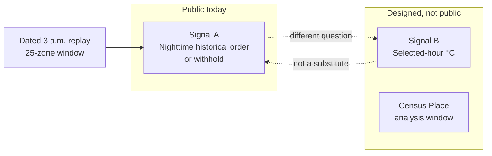
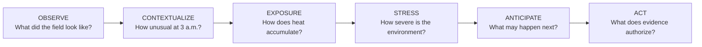
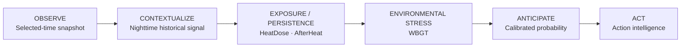
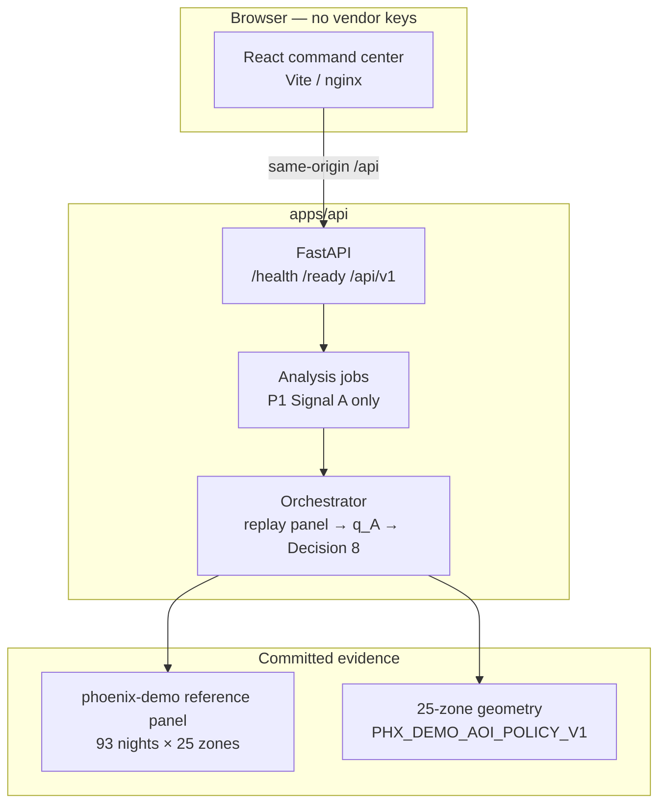
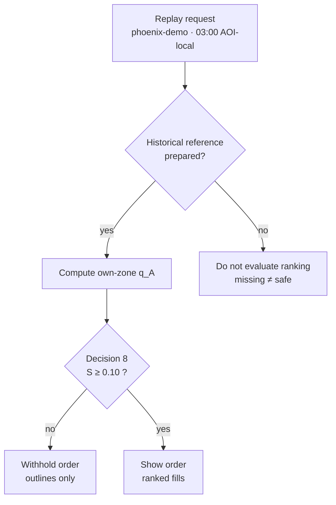

# HVA-Signal

**3K Labs** · Heat, Vulnerability & Action Signal

Shows a nighttime heat order only when the thermal field can defend it.

HVA-Signal is an urban heat **decision-support** system. It is not a heat map with two scores, and it is not a Phoenix-city dashboard. On the public path it answers one honest question: for a dated 3 a.m. replay on a 25-zone **analysis window**, is the thermal field differentiated enough to show a zone order — or must that order be withheld?

**Heat** is what is measured. **Vulnerability** is why zone scale matters — it is **not scored** in this build. **Action** is **available now as decision framing**: it translates Decision 8 into authorize or withhold. It is not a treatment plan and not proof that an intervention worked.

This repository is the runnable product, frozen replay evidence, tests, and deploy config. Local research notes and agent coordination live under `workforce/` and are not committed.

---

## Contents

1. [Overview](#1-overview)
2. [Problem](#2-problem)
3. [Product flow](#3-product-flow)
4. [What is available now](#4-what-is-available-now)
5. [Capability model](#5-beyond-a-snapshot-the-next-capability-layer)
6. [Architecture](#6-architecture)
7. [Signal A](#7-signal-a)
8. [Signal B status](#8-signal-b-status)
9. [National resolver status](#9-national-resolver-status)
10. [Evidence safeguards](#10-evidence-safeguards)
11. [Fail-closed philosophy](#11-fail-closed-philosophy)
12. [Installation](#12-installation)
13. [Local run](#13-local-run)
14. [API](#14-api)
15. [Testing](#15-testing)
16. [Data and provenance](#16-data-and-provenance)
17. [Limitations](#17-limitations)
18. [Security and spend](#18-security-and-spend)
19. [Project structure](#19-project-structure)
20. [Demo flow](#20-demo-flow)
21. [Status matrix](#21-current-status-matrix)
22. [3K Labs](#22-3k-labs)

---

## 1. Overview

HVA-Signal supports heat officers and program staff who have to defend a **zone-level order** — or defend the decision **not** to show one.

Publicly, that happens on **`phoenix-demo`**: an accountless command center and a legacy analysis job that runs the **Nighttime Historical Thermal Signal** (Signal A) at **03:00 AOI-local** from committed replay evidence. Default data mode is `DATA_MODE=replay`. There is no login and no signup.

`phoenix-demo` is a frozen 25-zone **HVA-Signal analysis geography** under `PHX_DEMO_AOI_POLICY_V1`. It is **not** Phoenix municipal coverage, **not** a heat district, and **not** a national resolve of Census place `0455000`.

A second question — what each zone’s average temperature was at a requested hour — is designed as a separate descriptive signal. It is **not published** on the public job API or command-center switch.



---

## 2. Problem

Municipal heat programs still receive **one map that ranks every night**. When the thermal field is nearly flat, that ranking is a manufactured targeting list. When history is missing, tools either invent a past or refuse the place without saying why.

HVA-Signal treats those as different failures:

- A ranking that the night cannot defend is worse than an empty map.
- A temperature at one hour is not unusualness versus a zone’s own nights.
- Geography ready is not historical reference ready.
- Missing data is **unknown**, never safe.

The product move is therefore **rank or withhold** — not “always fill the choropleth.”

---

## 3. Product flow

Every stage answers a **different** decision question. Do not collapse them into one score.



| Stage | Decision question | Public today |
|---|---|---|
| **Observe** | What was the zone-mean field, in °C, at a selected hour? | **Yes** — Signal B **AVAILABLE NOW — CACHED EVIDENCE** for phoenix-demo 2025-07-15 03:00 |
| **Contextualize** | How unusual was each zone at 3 a.m. versus its own nights, and is the spread large enough to show an order? | **Yes** — Signal A on `phoenix-demo` replay |
| **Exposure / persistence** | How does heat accumulate or linger after the peak? | **No** — no HeatDose or AfterHeat number |
| **Environmental stress** | What is wet-bulb globe temperature once complete inputs exist? | **No** — WBGT blocked |
| **Anticipate** | What is the calibrated chance of a defined event in a defined horizon? | **No** — public probability blocked |
| **Act** | What does the thermal evidence authorize or withhold? | **Yes** — **available now — decision framing** (Decision 8 translate only). No intervention engine |

Capability progression (same questions, product names):

```text
SNAPSHOT → HISTORICAL CONTEXT → EXPOSURE OVER TIME
        → ENVIRONMENTAL STRESS → FORECAST → ACTION
```

The public path starts at **historical context**, with Action as Decision 8 **decision framing**. Snapshot and later numeric stages are not extra gauges on the command center.

---

## 4. What is available now

Open the command center. No account. Leave **Data mode** on **Replay**.

| You can | You cannot |
|---|---|
| Run Signal A on `phoenix-demo` at 03:00 AOI-local | Pick a U.S. city or Census Place — place search is **disabled** |
| See **25 ranked fills** when spatial spread clears the configured floor | Treat fills as °C, harm chance, or “treat here first” |
| See **25 outlines and 0 fills** when the night is too flat | Read empty outlines as all-clear or low risk |
| Read Action framing: Decision 8 **supports spatial ordering** or **do not use thermal ranking alone** | Treat framing as a deploy order, harm-reduction percent, or all-clear |
| Inspect health, readiness, areas, and job status | Submit Signal B, spend, or live-acquire fields on the public job API |
| Replay two dated nights (see [Demo flow](#20-demo-flow)) | Switch to live vendor acquisition |

Default analysis time is `2022-07-01T03:00` (AOI-local). That night is Decision 8 **insufficient** (outlines only). `2022-06-30T03:00` is **sufficient** (backend-authorized ranked fills).

Code for place search, two-signal jobs, a selected-time snapshot, and a national geography library **exists in this repository**. Code existence is **not** enablement. Those surfaces stay **off** until their publication gates close.

---

## 5. Beyond a snapshot: the next capability layer

HVA-Signal is designed to grow from a spatial thermal-evidence system into a broader urban heat decision-support platform.

The foundation it is built around can describe the thermal field at a selected time, place nighttime conditions in historical context, and withhold spatial prioritization when the evidence cannot support an order.

**What you can run today** is the historical half of that foundation plus a dated cached Signal B snapshot: the Nighttime Historical Thermal Signal on the frozen phoenix-demo window, including the withhold, Action as **decision framing**, and Selected-Time Thermal Snapshot as **AVAILABLE NOW — CACHED EVIDENCE** for 2025-07-15 03:00. The public job API remains Signal A only.

The next capability layer extends that foundation from **what is happening** to **how heat develops over time**, **how severe environmental conditions become**, **what may happen next**, and **what decisions the evidence can support**.

These capabilities move into the public product only when their data requirements, analytical definitions, interpretation, and validation are defensible. HVA-Signal does not expose a metric simply because it can be calculated. It will not ship a number, gauge, or map layer for a module that has not cleared those gates.

Framing: **active capability expansion** — not “coming someday,” and not a strip of empty meters on the operational dashboard.



| Stage | Capability | User question | Maturity | Public surface |
|---|---|---|---|---|
| Observe | Selected-Time Thermal Snapshot (Signal B) | What was each zone’s average temperature, in °C, at the selected hour? | **AVAILABLE NOW — CACHED EVIDENCE** | **Cached 25/25** phoenix-demo 2025-07-15 03:00 America/Phoenix. Source fortyguard_cached. Not live. Not a rank. |
| Contextualize | Nighttime Historical Thermal Signal (Signal A) | How unusual was each zone at 3 a.m. versus its own nights, and is the difference large enough to show an order? | **Available now** | **Yes** — `phoenix-demo` replay at 03:00 AOI-local. Not live. |
| Exposure | HeatDose | How did **environmental** exposure accumulate over a named window? | **Analytical development in progress** | **Not shown.** No number. Not a personal dose. |
| Persistence | AfterHeat | How does the outdoor field behave after the daytime peak? | **Active development and validation** | **Not shown.** Not overnight recovery. |
| Stress | WBGT | What is wet-bulb globe temperature for a **named** form, once complete meteorological inputs exist? | **Integration pathway under evaluation** | **Not shown.** Will **not** approximate from incomplete inputs. |
| Anticipate | Calibrated probability / forecasting | What is the calibrated chance of a **defined** thermal event within a **defined** horizon? | **Model development and validation** | **Blocked.** No public percent. |
| Act | Action intelligence | What does the thermal evidence authorize or withhold? | **Available now — decision framing** | **Yes** — Decision 8 authorize / withhold translation only. Not an intervention engine. |

### HeatDose — accumulated exposure over time

A single temperature snapshot cannot tell us how long difficult thermal conditions persist. HeatDose is intended to distinguish a short-lived peak from sustained **environmental** exposure of a named variable, using a human-owned threshold for that same variable. There is **no frozen definition** and **no HeatDose number**. This is not individual physiological burden. `human_thermal_burden` remains false.

### AfterHeat — how heat persists after the peak

Extreme heat does not necessarily end when daytime temperatures start falling. AfterHeat investigates persistence and dissipation after the daytime peak. There is **no frozen metric**. Do not call it overnight recovery or a recovered / still-hot score. The 3 a.m. historical signal is **not** AfterHeat. `overnight_recovery` remains false.

### WBGT — environmental heat-stress context

Temperature alone does not represent all environmental factors relevant to heat stress. A future WBGT capability may use the **required** meteorological inputs once they exist, for a named form. HVA-Signal will **not** approximate WBGT from temperature only, temperature plus humidity only, or the current thermal heatmap.

### Calibrated probability — from evidence to forecast

A future probability capability may estimate the likelihood of a **clearly defined** thermal event within a **defined** forecast horizon, after ground truth, calibration, holdout, and out-of-distribution checks. Historical unusualness, Decision 8 contrast, temperature, confidence, and coverage are **not** probabilities. There is no public “XX%.”

### Action intelligence — translating evidence into decisions

**Available now — decision framing.** Scope is Decision 8 translate only: the public path restates whether the frozen historical protocol **authorizes a nighttime spatial order** or **refuses thermal ranking alone**. That is the same binary Signal A already computes — not a second score.

It is **not** validated intervention efficacy, not a deploy order, not harm-reduction percent, and not an Action map. `intervention_evidence` remains false. Vulnerability, preparedness, operational constraints, and local context remain necessary for actual intervention decisions and are **not scored**.

---

## 6. Architecture

The public stack is a modular FastAPI service and a React command center. Replay evidence is committed in-repo. Optional geography and two-signal routers are **not mounted** unless explicit flags are set — and those flags default **off**.



| Layer | Role |
|---|---|
| `apps/web` | Accountless command center. MapLibre map. Proxies `/api`, `/health`, `/ready` in dev. |
| `apps/api` | FastAPI monolith. In-memory job store. Replay-first analysis. |
| `data/phoenix/reference` | Frozen Decision 1B runtime panel for `phoenix-demo`. |
| `data/demo` | Legally distributable demo context. |
| `infra` | Docker Compose and Render blueprint. Replay by default. |

The runnable image must not depend on gitignored `workforce/` trees or sibling worktrees. A Census Gazetteer zip is **not** required to run `phoenix-demo`.

Schema stamp: `analysis_schema_version` `0.4`. Thermal-burden, intervention-evidence, and recovery model versions are unset — those modules are not active.

---

## 7. Signal A

**Nighttime Historical Thermal Signal** — **available now** on `phoenix-demo` replay.

**Question:** How unusual was each zone at 3 a.m. compared with its **own** historical 3 a.m. conditions, and is the difference across zones large enough to justify showing an order?

Each zone is compared with itself, not with “the hottest block in the city.” An order is shown only when the night differs enough.

| Outcome | Map | Meaning |
|---|---|---|
| **Order shown** | 25 outlines + 25 fills | Spatial differentiation is strong enough. Fills are historical nighttime **order**, not degrees Celsius and not a probability. |
| **Order withheld** | 25 outlines, **0** fills | Unusualness may be computed; the field is too flat to defend a ranking. This is the product, not a broken map, and not a safety clearance. |
| **History not prepared** | Neutral / no order | Geography can exist without a reference panel. Signal A is not evaluated. Missing history is not treated as safe. |

On `phoenix-demo`, the frozen reference is 93 dates × 25 tracts at 03:00 America/Phoenix (seasonal window 30 June–30 July, years 2022–2023–2024). The statistic is a year-balanced own-tract midrank ECDF. The target night is excluded from its own reference.

**Method (not first-touch copy):** `q_A` is that historical position — **not** a probability and **not** a percent chance of harm. Decision 8 is the ordering gate: spread `S` = top-3 minus bottom-3 mean `q_A`, floor **0.10** `q_A` units (`PHX_NORMALIZED_HAZARD_SPREAD_V1_TOP3_BOTTOM3_QA_FLOOR_0P10`). Below the floor: outlines only. At or above: backend-authorized ranks.

Observed on the frozen replay (same protocol, two adjacent nights):

| AOI-local time | Observed `S` | Gate | Map |
|---|---|---|---|
| 2022-07-01 03:00 | ≈ 0.044 | Insufficient vs 0.10 floor | 25 outlines, 0 ranked fills |
| 2022-06-30 03:00 | ≈ 0.135 | Sufficient | 25 ranked fills |

Do not call Signal A overnight recovery, current risk, NOW, intervention priority, or AfterHeat.



---

## 8. Signal B status

**Selected-Time Thermal Snapshot** — **AVAILABLE NOW — CACHED EVIDENCE**. Phoenix-demo 2025-07-15 03:00 America/Phoenix, 25/25 zone means, source ortyguard_cached. **Not live.** Downtown 0/25 TCM fixture remains a negative hold.

**Question:** What was each zone’s average temperature, in °C, at the selected hour?

Rules if it is ever published:

- Description only. Absolute zone-mean °C.
- Not `q_A`, not Decision 8, not rank, not priority, not danger, not NOW, not current conditions.
- Not a tile map and not a substitute for the historical signal.
- Color must not invent contrast (no current-window min/max stretch, no percentile stretch).
- Cached evidence must be labeled **cached**, never live.
- A withheld Signal A order does **not** suppress a genuine snapshot. A snapshot does **not** authorize ranking.
- No combined A+B score.

Public POST /api/v1/analysis/jobs is the **legacy Signal A** contract. Unpublished snapshot and spend fields are rejected (**422**). The two-signal sibling route is **not** in the default OpenAPI. Command-center Signal B chrome shows the cached phoenix-demo snapshot.

The public phoenix-demo bind is the processed 25/25 cached snapshot (ctivity_id e0244934-0840-4072-bcb6-96cca26a9a20). The downtown hourly TCM fixture stays 0/25. The vendor tile dump is not shipped. A schematic fixture is not product evidence.

---

## 9. National resolver status

A 2025 Census Place (incorporated place or CDP, 7-digit GEOID) may later resolve to a versioned **25-zone HVA-Signal analysis geography** — an analysis window **within** that place, generated under resolver policy `NATIONAL_PLACE_GEOGRAPHY_V1` (candidate).

| Claim | Status |
|---|---|
| Resolver library in this repo | Present (internal) |
| Policy label | **Frozen candidate** — not `FROZEN` |
| Public `GET /api/v1/areas` | **`phoenix-demo` only** |
| Public place search | **Disabled** |
| Public geography resolve | **Disabled** — **L2 timezone** open |
| City-equivalence (window = municipality) | **Human-open** |
| Seed uniqueness (this 25-set is “the” geography of the place) | **Human-open** |

Safe wording:

> 25-zone HVA-Signal analysis geography — an analysis window within {Census NAMELSAD}, generated under resolver policy {policy id}.

Do not say “the city,” “city-wide,” “{place}’s zones,” “supported city,” or “the geography of {place}.” Another seed or policy is a **different** analysis geography.

Public resolve stays **disabled** while the **L2 timezone** gate is open: this image has no shippable zero-vendor lon/lat → IANA lookup. Without an injected lookup, national materialize fails closed (timezone not found). A state table would falsify split-zone borders. That also blocks a national selected-time snapshot.

On a newly resolved window, geography can be ready while **historical reference is not prepared**. Signal A, Decision 8, and thermal ranking stay unavailable. HVA-Signal does not invent a 93-observation history and does not copy the `phoenix-demo` Decision 8 floor onto a new place. A later selected-time snapshot is **not** a substitute for the historical signal.

`phoenix-demo` and a national `us-place-0455000-…` package would be **different identities**. Never equate them.

---

## 10. Evidence safeguards

- **Two questions, two stories.** Do not blend Signal A and Signal B into one badge, one map ramp, or one score.
- **Own-zone history.** Unusualness is versus that zone’s own 3 a.m. nights, not a city-wide hottest-first list.
- **Ordering gate.** Ranked fills require backend Decision 8 authorization. The client does not invent an order from a flat field.
- **Insufficient is valid.** Outlines-only is a completed, honest result.
- **Split readiness.** Geography ready ≠ reference prepared ≠ snapshot capable. Never one green “Ready.”
- **Replay / cached / live stay distinct.** Replay is committed fixtures. Cached is reused prior vendor evidence and must say **cached**. Live acquire is a server allowance and is **off**.
- **No silent inherit.** A new analysis window does not inherit `phoenix-demo` history, ranks, or floors.
- **Provenance over decoration.** Source, clock, geometry version, and data mode belong on the result. Method nouns (`q_A`, Decision 8) belong in method / disclosure, not the first sentence.

---

## 11. Fail-closed philosophy

When evidence is missing, thin, unauthorized, or spatially undifferentiated, HVA-Signal **withholds** the product claim rather than filling the gap.

| Situation | Behavior |
|---|---|
| Hazard spread below the 0.10 `q_A` floor | Outlines; no ranked fills |
| Historical reference not prepared | Signal A not evaluated; not “low risk” |
| Zero valid thermal tiles | Insufficient evidence; not a ratio-smoothed pass |
| Unknown `area_id` | Rejected — do not type a second area in the demo |
| Unknown `job_id` (process restart) | `unknown_job` + `recoverable: true` so the UI can resubmit |
| Unpublished request fields on P1 jobs | **422** |
| Hosted live / demo allowance | Disabled (`enabled=false`, `max_total=0`) |
| Incomplete WBGT inputs | No WBGT number |
| Undefined forecast event | No public probability |

Missing is unknown. Unknown is not safe. A withheld ranking is not 0% risk.

---

## 12. Installation

Requirements: **Python 3.12+**, **Node.js 20+** (for the web app and Playwright), Git.

```bash
git clone <this-repo>
cd hackathon
cp .env.example .env
```

Keep `DATA_MODE=replay`. Leave `FORTYGUARD_API_KEY` empty for local and judge replay.

**API**

```bash
cd apps/api
python -m venv .venv
# Windows: .venv\Scripts\activate
# macOS/Linux: source .venv/bin/activate
pip install -e ".[dev]"
```

**Web**

```bash
cd apps/web
npm install
```

---

## 13. Local run

**Dev (two processes)**

```bash
# Terminal 1 — API
cd apps/api
uvicorn app.main:app --reload --port 8000
```

```bash
# Terminal 2 — Vite (http://localhost:5173, proxies /api to :8000)
cd apps/web
npm run dev
```

**Production-like images**

Docker Compose serves nginx at **http://localhost:8080** (and **http://localhost:18080** if 8080 is taken). API on **:8000**. Nginx proxies `/api`, `/health`, and `/ready`.

```bash
docker compose -f infra/docker-compose.yml up --build
```

Leave **Data mode** on **Replay**. Do not select Live.

Public always-on hosting is a **human** dashboard step (Render Starter, not a sleeping Free tier, if that URL is the judged demo). See `infra/DEPLOY.md`. Do not invent a hostname. Do not treat loopback as the judges deployment.

---

## 14. API

Live OpenAPI at default flags is **six paths**. FastAPI serves `/docs` locally; the contract below is the public surface.

| Method | Path | Role |
|---|---|---|
| `GET` | `/health` | Liveness (`{"status":"ok"}`) |
| `GET` | `/ready` | Readiness + `data_mode` |
| `GET` | `/api/v1/areas` | Supported areas — **`phoenix-demo` only** |
| `GET` | `/api/v1/areas/{area_id}/geometry` | GeoJSON + geometry SHA headers |
| `POST` | `/api/v1/analysis/jobs` | Create Signal A / legacy job (`202`) |
| `GET` | `/api/v1/analysis/jobs/{job_id}` | Poll job; unknown ids return `unknown_job` |

Not mounted at default flags (and not judge features):

- `/api/v1/places`, `/api/v1/geographies` — require `HVA_PUBLIC_GEOGRAPHY` (off)
- `/api/v1/analysis/two-signal-jobs` — require `HVA_PUBLIC_TWO_SIGNAL` (off)

Do not send Signal B, spend-authorization, or login fields on the public job API.

---

## 15. Testing

```bash
# API
cd apps/api
pytest

# Web
cd apps/web
npm test

# End-to-end (repo root; API venv installed)
npx playwright install chromium
npm run test:e2e
```

Suites lock replay behavior, Decision 8 authorize/withhold, unpublished-field rejection, Phoenix frozen hashes, and default-off flags. Playwright expects the web preview and API in replay mode (see `tests/e2e/README.md`).

Do not point CI or a demo script at a live vendor heatmap.

---

## 16. Data and provenance

| Asset | What it is |
|---|---|
| `phoenix-demo` geometry | 25 census tracts under `PHX_DEMO_AOI_POLICY_V1`. Zone geometry version is pinned (`US_CENSUS_TIGERLINE.CENSUS_TRACT.2025.AZ…`). |
| Decision 1B panel | Frozen nighttime reference: 93 timestamps × 25 zones, 03:00 America/Phoenix, years 2022–2024, seasonal 30 June–30 July. |
| Aggregation | Centroid-within mean of vendor 100 m thermal tiles **into zones**. User-facing product is **25-zone**, not 100 m targeting. Localization at 100 m is **not** established. |
| Replay | Committed fixtures / frozen panel. No live acquire. Source banner: **REPLAY**. |
| Cached | Reused prior vendor evidence, if a later path exists. Label **CACHED**, never LIVE. |
| Live | Hosted acquire under a server allowance. **Off.** |

Vendor credentials, if ever configured, stay on the **backend**. The frontend never receives them. The public path does **not** POST a vendor heatmap. Hackathon vendor terms end with the event; a production service would need a commercial agreement.

Evidence status is **per signal**. Do not collapse A and B into one badge.

---

## 17. Limitations

HVA-Signal does **not** currently:

- predict individual harm or emit a calibrated heat-event probability
- score vulnerability, equity, or preparedness
- prove intervention effectiveness or recommend a deploy order
- validate 100 m localization as a targeting product
- publish Signal B, place search, or national resolve
- acquire live vendor evidence on the public path
- treat `phoenix-demo` as the City of Phoenix
- close Architecture Gate 0 or Milestone 0 (always-on public URL still a human hosting step)

`q_A` is not a probability. `Action` in the product name means decision support. National policy remains **frozen candidate** while city-equivalence and seed-uniqueness stay human-open.

Why extra surfaces stay off (product blockers, not polish):

| Reason | Effect |
|---|---|
| `phoenix-demo` must not collapse into Census place `0455000` | No “Phoenix” city picker |
| **L2 timezone** — no shippable offline lon/lat → IANA lookup | No public national resolve or national Signal B |
| Search plus thermal chrome would overclaim | Place search stays **disabled** |
| Public jobs must not leak spend or live-grant fields | Allowance schemas stay off the P1 API |
| Signal B must not reuse the Signal A rank map | No snapshot switch on the command center |
| `NOT_PREPARED` must not read as low risk | No fake “analysis complete” on a new window |
| The opening demo must not be a cold national resolve | Landing stays `phoenix-demo` replay |

---

## 18. Security and spend

| Control | Default |
|---|---|
| Account / login | **None** — and not required |
| `DATA_MODE` | `replay` |
| `HVA_PUBLIC_GEOGRAPHY` | Off |
| `HVA_PUBLIC_TWO_SIGNAL` | Off |
| `HVA_CENSUS_FETCH` | Off |
| Vite place-search / snapshot flags | Off (and chrome not mounted) |
| Demo allowance | `enabled=false`, `max_total=0` |
| Hosted live / real vendor grant | **Disabled** — no public spend path |
| `FORTYGUARD_API_KEY` | Empty in `.env.example`; backend only if ever set |

A client “live” preference is **intent**, not authorization. Replay and compatible cached evidence do not require spend. This repository must not be operated as a paid-live judges demo until a human enables an allowance **and** an always-on host exists.

Do not paste vendor keys into the browser. Do not enable Census fetch to “make search interesting.” Do not treat flag-on as publication.

---

## 19. Project structure

```text
apps/api     FastAPI modular monolith (jobs, areas, gated optional routers)
apps/web     React + TypeScript command center (Vite, MapLibre)
data/demo    Legally distributable demo datasets
data/phoenix/reference   Frozen Decision 1B runtime panel
infra        Docker Compose, Render blueprint, DEPLOY.md
scripts      Maintenance and sanitization
tests/e2e    Playwright
```

---

## 20. Demo flow

Presenter or judge, **replay only**. Source banner must stay **REPLAY**. Do not open Live, a second `area_id`, or a city search — those controls are not the public product.

1. Open Vite `http://localhost:5173` or Compose `http://localhost:8080`.
2. Confirm **`phoenix-demo`**, **03:00 AOI-local**, **replay**. Submit the default `2022-07-01T03:00`.
3. Map: **25 outlines, 0 fills**. Unusualness can be computed; the order is withheld because observed spread is about **0.044** versus a **0.10** `q_A` floor.
4. Change the date to **`2022-06-30`** (time stays 03:00). Submit.
5. Map: **25 ranked fills**. Observed spread about **0.135**. Fills are historical nighttime order, not °C, not harm probability.
6. Read Action framing on the same nights: 2022-06-30 **supports spatial ordering** (one input, not a deploy order); 2022-07-01 **do not use thermal ranking alone** (withhold is not all-clear). Framing is Decision 8 translate only.
7. Say the second question out loud: selected-hour °C is descriptive only, **AVAILABLE NOW — CACHED EVIDENCE** for 15 Jul 03:00, 25/25, not live.
8. Do not demo a national place resolve. Place search is **disabled**. If asked: **L2 timezone** is still open (no shippable offline lon/lat → IANA lookup); a Census Place can later become a versioned 25-zone **analysis window** inside the place; historical Signal A would stay unprepared until a reference package exists; hosted live is **off**.

If a hosted Free URL is asleep, record or judge from local Compose / Vite and say hosting is a human always-on step.

---

## 21. Current status matrix

| Surface | Status |
|---|---|
| `phoenix-demo` Signal A replay | **Available now** |
| Accountless command center | **Available now** |
| Decision 8 rank-or-withhold | **Available now** (Signal A) |
| Action intelligence | **Available now — decision framing** (Decision 8 translate only) |
| Public Signal B / selected-time snapshot | **AVAILABLE NOW — CACHED EVIDENCE** (phoenix-demo 2025-07-15 03:00, 25/25, not live) |
| Public two-signal job API | **Disabled** |
| Place search | **Disabled** |
| Public geography resolve | **Disabled** (**L2 timezone**) |
| National resolver library | Present · policy **frozen candidate** · no public route |
| Hosted live | **Disabled** |
| Demo allowance | **Disabled** |
| Login / BYOK | **None** / **planned** (not this demo) |
| Combined A+B score | **Forbidden** |
| Vulnerability score | **Not built** |
| HeatDose / AfterHeat / WBGT numbers | **Not shown** |
| Public numeric probability | **Blocked** |
| Action engine / intervention efficacy | **Not shipped** |
| Always-on judges URL | **Not claimed** — human hosting step |
| Architecture Gate 0 / Milestone 0 | **Open** |

---

## 22. 3K Labs

HVA-Signal is built by **3K Labs**.

The name expands to Heat, Vulnerability & Action Signal. Only **Heat** is measured on the public path. Vulnerability explains zone scale and is not scored. Action is **available now as decision framing** from Decision 8, not a certified cooling program.

Contact and hosting for a judged demo are human-owned. This README describes the repository as it runs with **default flags off** and **replay on**.
