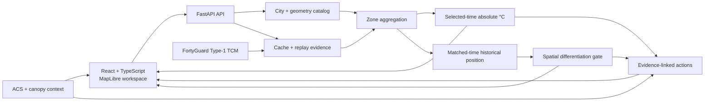

# HVA-Signal

**Heat, Vulnerability & Action Signal** · 3K Labs

HVA-Signal is a map-first decision-support tool for urban heat resilience. It helps a city team answer a simple but important question:

> **Does the thermal evidence actually justify treating particular zones differently?**

If the answer is yes, the product helps the user inspect where the difference is. If the answer is no, HVA-Signal does not manufacture a hotspot ranking. It keeps the thermal finding visible, adds local context, and points to the next evidence or operational checks that may matter.

**Public web:** https://urban-thermal-web.onrender.com  
**API:** https://urban-thermal-api.onrender.com  
**Health:** https://urban-thermal-api.onrender.com/health  
**Readiness:** https://urban-thermal-api.onrender.com/ready

---

## What the product does

The interface follows one decision loop:

**HEAT → CONTEXT → ACTION → OUTLOOK**

- **Heat** — inspect a selected-time thermal observation and determine whether the spatial differences are meaningful enough to support a zone ordering.
- **Context** — inspect variables such as tree canopy, median household income and older housing without combining them into a synthetic vulnerability score.
- **Action** — surface a small number of evidence-linked checks, with a reason for why each one is shown.
- **Outlook** — identify what should be observed or compared next.

The central design choice is deliberate: **a map is not automatically a ranking**. A zone that is a fraction of a degree warmer than its neighbour is not presented as a priority area unless the analysis supports that interpretation.

## Cities and published evidence

The current product supports four comparison geographies, each with 25 zones:

| City | Published selected-time comparison | Local context |
| --- | --- | --- |
| Phoenix, AZ | 8 Jul 2024 · 15:00 local | Yes |
| Las Vegas, NV | 8 Jul 2024 · 15:00 local | Yes |
| Tucson, AZ | 8 Jul 2024 · 15:00 local | Yes |
| Los Angeles, CA | 8 Jul 2024 · 15:00 local | Yes |

The four-city comparison therefore covers **100 zones on one shared absolute temperature scale**.

Phoenix also has a deeper local evidence package. It includes a matched 03:00 reference panel for the 30 June–30 July window in 2022, 2023 and 2024: **93 matched timestamps × 25 zones = 2,325 zone observations**. Across the Phoenix analysis geography, the matched-window mean at 03:00 was 32.83 °C in 2022, 33.90 °C in 2023 and 34.35 °C in 2024.

That historical comparison is intentionally described as **matched nighttime conditions across years**. It is not an overnight cooling curve, a measure of overnight recovery, or a climate-trend estimate.

## The two thermal signals

HVA-Signal keeps two different questions separate.

### Selected-time thermal snapshot

A selected observation is shown as **absolute zone-mean temperature in °C**. The thermal map uses a fixed shared display scale; it is not stretched to the minimum and maximum of the visible city.

This layer is descriptive. It is not a probability, risk score, anomaly score or priority ranking.

### Nighttime historical position

For the Phoenix reference analysis, each zone can be compared with its own matched-time historical distribution at 03:00. This produces `q_A`, a historical-position measure.

`q_A` answers **“where does this observation sit relative to this zone's own matched history?”** It does not answer **“which zone is absolutely hottest?”**

The spatial-differentiation policy then checks whether the field contains enough separation to support an ordering. When it does not, ranking colours are withheld rather than replaced with a weak guess.

The current frozen policy is versioned as:

`PHX_NORMALIZED_HAZARD_SPREAD_V1_TOP3_BOTTOM3_QA_FLOOR_0P10`

That threshold is a product decision policy, not a health-outcome calibration. Sensitivity analysis and alternative full-field spread statistics are part of the next methodological iteration rather than claims made by this version.

## Architecture



The frontend is a React/TypeScript application with MapLibre for geographic interaction. The API is FastAPI. Published observations and their provenance are served through replay/cache paths so the public demo is reproducible and does not create an uncontrolled vendor request simply because somebody opens the page.

## FortyGuard usage

FortyGuard is the primary thermal-data provider. HVA-Signal uses **Type-1 TCM heatmaps at 100 m** for selected-time urban temperature observations. Vendor tiles are aggregated into the fixed analysis zones before they reach the decision layer.

The integration is deliberately cache-first. Repeating an identical request should reuse the existing evidence rather than submit the same paid request again.

The repository also contains a narrowly scoped bounded selected-time live path:

`POST /api/v1/live/selected-time`

That route accepts only a city and city-local hourly timestamp. AOI geometry, resolution, metric, provider configuration and credentials remain server-owned. The general arbitrary-vendor path is refused by design.

**The current public Render deployment runs in replay mode and keeps bounded live disabled.** The Live control is not exposed in the public UI until a production cache/spend proof has been completed for the deployed configuration. This preserves a working published product instead of presenting a control that cannot complete its workflow.

## Context data

Context is kept separate from thermal evidence. The current product uses:

- **US Census Bureau TIGER/Line 2025** for tract geometry;
- **ACS 2020–2024 5-year estimates** for socioeconomic and housing context;
- **national tree-canopy context** for the cross-city comparison;
- **Phoenix-specific canopy evidence** where the local Phoenix contract supports it.

Context layers may use a relative colour range within the displayed comparison geography. The legend labels that behaviour explicitly and preserves the underlying numeric values. Context variables are not collapsed into a composite vulnerability score.

## Interpretation boundaries

The product intentionally does **not** claim:

- individual heat harm or medical risk;
- a calibrated probability of harm;
- WBGT where it has not been validated;
- overnight recovery from isolated 03:00 observations;
- a climate trend from the three matched summer windows;
- intervention effectiveness;
- a forecast when the provider contract does not support one;
- causation from cross-city or canopy correlations.

Missing evidence remains unknown. It is not converted to zero or a favourable assumption.

## Data flow and provenance

A simplified request path is:

```text
city + observation
        │
        ▼
fixed server-owned geography
        │
        ▼
FortyGuard observation / verified cache
        │
        ▼
zone aggregation
        │
        ├──► absolute selected-time °C
        │
        └──► historical-position analysis where a valid reference exists
                    │
                    ▼
            spatial differentiation gate
                    │
                    ▼
thermal finding + context + evidence-linked next checks
```

Cross-city acquisitions retain provider activity/provenance records and request fingerprints. The Phoenix historical reference panel is versioned and checksum-protected; its matched-time interpretation is deliberately narrower than a continuous overnight series.

## Repository layout

```text
apps/
  api/                  FastAPI service, analytics, provider integration
  web/                  React/TypeScript product UI
data/
  acquisitions/         acquisition records and reproducible evidence
  context/              contextual datasets and contracts
  phoenix/              Phoenix reference evidence
  cross-city/           cross-city comparison packages
docs/                   analytical, release and provenance notes
infra/                   Render deployment blueprint
scripts/                 validation and operational utilities
```

The deployed product UI lives under `apps/web/src/features/workspace/`.

## Run locally

### API

Python 3.12 or newer is required.

```bash
cd apps/api
python -m venv .venv
# activate the virtual environment for your shell
pip install -e ".[dev]"
DATA_MODE=replay uvicorn app.main:app --reload --port 8000
```

On Windows PowerShell, set replay mode with:

```powershell
$env:DATA_MODE="replay"
uvicorn app.main:app --reload --port 8000
```

### Web

Node 22 is used in CI.

```bash
cd apps/web
npm ci
npm run dev
```

The production build is:

```bash
npm run build
```

## Tests

The CI pipeline runs the API suite, web unit tests, the production web build and Playwright end-to-end checks.

```bash
# API
cd apps/api
pytest

# Web
cd apps/web
npm test
npm run build

# End-to-end (with API and web preview running)
cd ../..
npm ci
npm run test:e2e
```

Regression coverage includes the frozen Phoenix Decision 8 historical panel, fail-closed vendor behaviour, four-city geometry/data joins, cross-city comparison contracts and browser-level product flows.

## Deployment

Render deployment is defined in `infra/render.yaml` (with the required root blueprint copy where applicable). The public services are:

- Web: https://urban-thermal-web.onrender.com
- API: https://urban-thermal-api.onrender.com

The public deployment is intentionally replay-backed. Opening or navigating the product must not trigger a paid FortyGuard request.

## What we are shipping next

The near-term product direction is to make the same evidence discipline useful over more observations, not to add a synthetic score.

1. **Matched observed instants across cities** — compare the same local observation times across all four city geographies once the evidence package is acquired and validated.
2. **Bounded selected-time Live** — activate the existing narrow live path only after production cache/spend verification proves an identical rerun creates no duplicate provider activity or debit.
3. **Stronger event-level thermal context** — make severe or persistent matched-time conditions clear without confusing event severity with spatial differentiation.
4. **Method validation** — run sensitivity analysis on the current spatial-differentiation threshold and compare it with robust full-field alternatives before changing the frozen V1 policy.
5. **More operational context** — add preparedness/resource evidence only where source coverage and provenance support it.

The principle stays the same: **show what the evidence supports, and make the absence of defensible spatial differentiation explicit rather than inventing precision.**

## License

See [LICENSE](LICENSE).
